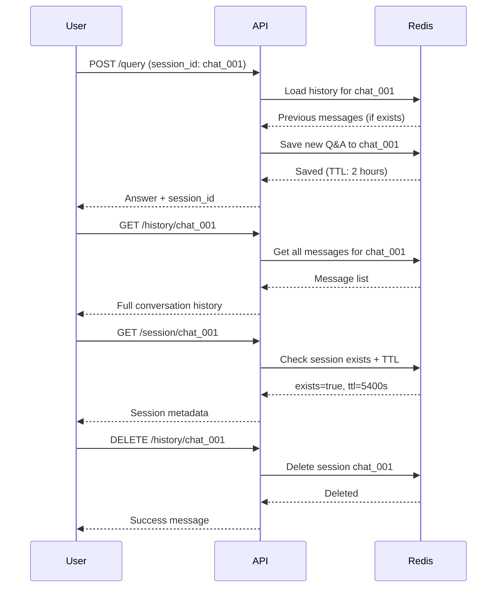

<div align="center">

# 🗨️ Chat History Management

**View and manage conversation history**

[](https://fastapi.tiangolo.com/)
[](https://redis.io)

</div>

---

## 📋 Overview

Chat history endpoints allow users to view past conversations, check session information, and clear conversation history. All conversations are stored in Redis with a 2-hour TTL.

<<<<<<< HEAD
**🔓 Authentication:** Not required (public access)
=======
**🔓 Authentication:** Not required for history/info/delete; admin token required for session listing
>>>>>>> bb677be (feat : update logging error)

### Available Endpoints

| Method | Endpoint | Description |
|--------|----------|-------------|
| `GET` | `/api/v1/history/{session_id}` | Get conversation history |
| `GET` | `/api/v1/session/{session_id}` | Get session metadata |
| `DELETE` | `/api/v1/history/{session_id}` | Clear conversation history |
<<<<<<< HEAD
=======
| `GET` | `/api/v1/sessions` | List active chat session IDs (admin) |
>>>>>>> bb677be (feat : update logging error)

---

## 1. Get Chat History

### `GET /api/v1/history/{session_id}`

Retrieve all messages in a conversation session.

### Request

**Path Parameters:**

| Parameter | Type | Required | Description |
|-----------|------|----------|-------------|
| `session_id` | string | ✅ Yes | Session identifier |

**Headers:**
```
(No authentication required)
```

### Response

**Success (200 OK):**
```json
{
  "session_id": "user_session_123",
  "messages": [
    {
      "role": "human",
      "content": "What is machine learning?"
    },
    {
      "role": "ai",
      "content": "Machine learning is a subset of artificial intelligence that enables systems to learn and improve from experience without being explicitly programmed."
    },
    {
      "role": "human",
      "content": "What are its main types?"
    },
    {
      "role": "ai",
      "content": "The main types of machine learning are: 1) Supervised Learning, 2) Unsupervised Learning, and 3) Reinforcement Learning."
    }
  ],
  "message_count": 4,
  "ttl": 5400
}
```

**Error (404 Not Found):**
```json
{
  "detail": "Session user_session_123 not found or expired"
}
```

### Response Fields

| Field | Type | Description |
|-------|------|-------------|
| `session_id` | string | Session identifier |
| `messages` | array | List of conversation messages |
| `messages[].role` | string | Message sender (`"human"` or `"ai"`) |
| `messages[].content` | string | Message content |
| `message_count` | integer | Total number of messages |
| `ttl` | integer | Time-to-live in seconds (remaining before expiration) |

### Postman Testing

**Step 1:** Create new GET request
```
GET http://localhost:8000/api/v1/history/user_session_123
```

**Step 2:** Send request (no authentication needed)

**Step 3:** View conversation history in response

### cURL Example

```bash
curl -X GET "http://localhost:8000/api/v1/history/user_session_123"
```

---

## 2. Get Session Info

### `GET /api/v1/session/{session_id}`

Get metadata about a conversation session without retrieving full message history.

### Request

**Path Parameters:**

| Parameter | Type | Required | Description |
|-----------|------|----------|-------------|
| `session_id` | string | ✅ Yes | Session identifier |

**Headers:**
```
(No authentication required)
```

### Response

**Session Exists (200 OK):**
```json
{
  "session_id": "user_session_123",
  "exists": true,
  "message_count": 4,
  "ttl": 5400
}
```

**Session Not Found (200 OK):**
```json
{
  "session_id": "user_session_999",
  "exists": false,
  "message_count": 0,
  "ttl": null
}
```

### Response Fields

| Field | Type | Description |
|-------|------|-------------|
| `session_id` | string | Session identifier |
| `exists` | boolean | Whether session exists in Redis |
| `message_count` | integer | Number of messages (0 if not exists) |
| `ttl` | integer \| null | Seconds until expiration (null if expired/not exists) |

### Postman Testing

**Step 1:** Create new GET request
```
GET http://localhost:8000/api/v1/session/user_session_123
```

**Step 2:** Send request

**Step 3:** Check if session exists and view metadata

### cURL Example

```bash
curl -X GET "http://localhost:8000/api/v1/session/user_session_123"
```

---

## 3. Clear Chat History

### `DELETE /api/v1/history/{session_id}`

Delete all messages in a conversation session.

### Request

**Path Parameters:**

| Parameter | Type | Required | Description |
|-----------|------|----------|-------------|
| `session_id` | string | ✅ Yes | Session identifier to clear |

**Headers:**
```
(No authentication required)
```

### Response

**Success (200 OK):**
```json
{
  "session_id": "user_session_123",
  "success": true,
  "message": "Successfully cleared history for session user_session_123"
}
```

**Session Not Found (200 OK):**
```json
{
  "session_id": "user_session_999",
  "success": false,
  "message": "No history found for session user_session_999"
}
```

### Response Fields

| Field | Type | Description |
|-------|------|-------------|
| `session_id` | string | Session identifier |
| `success` | boolean | Whether history was cleared |
| `message` | string | Status message |

### Postman Testing

**Step 1:** Create new DELETE request
```
DELETE http://localhost:8000/api/v1/history/user_session_123
```

**Step 2:** Send request

**Step 3:** Verify success message

**Step 4 (Optional):** Try getting history again (should return 404)
```
GET http://localhost:8000/api/v1/history/user_session_123
```

### cURL Example

```bash
curl -X DELETE "http://localhost:8000/api/v1/history/user_session_123"
```

---

<<<<<<< HEAD
=======
## 4. List Chat Sessions

### `GET /api/v1/sessions`

Retrieve session IDs that currently have chat history stored in Redis.

> **Requires admin access.** Include a valid `Authorization: Bearer <token>` header.

### Request

**Query Parameters (optional):**

| Parameter | Type | Description |
|-----------|------|-------------|
| `limit` | integer | Maximum number of session IDs to return (1-1000). |

**Headers:**
```
Authorization: Bearer <admin_access_token>
```

### Response

**Success (200 OK):**
```json
{
  "sessions": [
    "anon_6efb8f62-4d52-4cb5-98d9-2e6c9dc742c1",
    "user_acme_2025",
    "demo_session"
  ],
  "total": 3
}
```

**Error (500 Internal Server Error):**
```json
{
  "detail": "Failed to list chat sessions: Redis connection refused"
}
```

### cURL Example

```bash
curl -X GET "http://localhost:8000/api/v1/sessions?limit=20" \
  -H "Authorization: Bearer <admin_access_token>"
```

---

>>>>>>> bb677be (feat : update logging error)
## 🔄 Complete Chat History Flow



---

## 💡 Best Practices

### 1. Session ID Naming

**Good Naming:**
```
user_123_chat          # User-specific session
support_session_456    # Support ticket session
anonymous_abc123       # Anonymous user (auto-generated)
lecture_cs101_001      # Lecture-specific
```

**Bad Naming:**
```
session1               # Too generic
abc                    # Too short, unclear
temp                   # Doesn't indicate purpose
```

### 2. Session Management

```javascript
// Frontend example: Persist session_id
const sessionId = localStorage.getItem('chat_session') || `user_${userId}_${Date.now()}`;

// Make query
fetch('/api/v1/query', {
  method: 'POST',
  body: JSON.stringify({
    question: "What is AI?",
    session_id: sessionId  // Consistent across conversation
  })
});

// Save for future requests
localStorage.setItem('chat_session', sessionId);
```

### 3. Clearing Old Sessions

```javascript
// Check session before using
const checkSession = async (sessionId) => {
  const response = await fetch(`/api/v1/session/${sessionId}`);
  const data = await response.json();

  if (!data.exists || data.ttl < 300) {  // Less than 5 minutes
    // Clear and create new session
    await fetch(`/api/v1/history/${sessionId}`, { method: 'DELETE' });
    return createNewSession();
  }

  return sessionId;
};
```

### 4. Displaying Chat History

```javascript
// Load and display history
const loadHistory = async (sessionId) => {
  const response = await fetch(`/api/v1/history/${sessionId}`);

  if (response.ok) {
    const data = await response.json();
    data.messages.forEach(msg => {
      displayMessage(msg.role, msg.content);
    });
  } else {
    console.log('No previous history');
  }
};
```

---

## 📊 Configuration

| Setting | Default Value | Description |
|---------|---------------|-------------|
| History TTL | 7200 seconds (2 hours) | Auto-expiration time |
| Max messages | 10 messages | Oldest messages auto-removed |
| Message format | `{role, content}` | Stored format in Redis |
| Storage backend | Redis | Persistent across restarts |

**Note:** TTL refreshes on every new message in the conversation.

---

## 🛠️ Common Errors

### 1. Session Not Found
```json
{
  "detail": "Session user_session_123 not found or expired"
}
```
**Causes:**
- Session ID doesn't exist
- Session expired (> 2 hours)
- Session was deleted

**Solution:** Start new conversation with new session_id.

### 2. Redis Connection Error
```json
{
  "detail": "Failed to retrieve chat history: Redis connection refused"
}
```
**Solution:** Ensure Redis server is running.

### 3. Invalid Session ID
```json
{
  "detail": "Failed to get session info: Invalid session_id format"
}
```
**Solution:** Use alphanumeric session IDs without special characters.

---

## 🔍 Testing Scenarios

### Scenario 1: New Conversation

1. **Query without session_id**
```bash
curl -X POST "http://localhost:8000/api/v1/query" \
  -H "Content-Type: application/json" \
  -d '{"question": "What is Python?"}'
```

Response includes auto-generated `session_id`.

2. **Continue conversation**
```bash
curl -X POST "http://localhost:8000/api/v1/query" \
  -H "Content-Type: application/json" \
  -d '{
    "question": "What are its features?",
    "session_id": "anon_abc123"
  }'
```

3. **View history**
```bash
curl -X GET "http://localhost:8000/api/v1/history/anon_abc123"
```

---

### Scenario 2: Session Expiration

1. **Check session info**
```bash
curl -X GET "http://localhost:8000/api/v1/session/old_session"
```

If `ttl` is low (< 5 minutes), consider starting new session.

---

### Scenario 3: Privacy - Clear History

1. **User requests to clear history**
```bash
curl -X DELETE "http://localhost:8000/api/v1/history/user_session_123"
```

2. **Verify deletion**
```bash
curl -X GET "http://localhost:8000/api/v1/history/user_session_123"
# Should return 404
```

---

## 📈 Performance

| Metric | Value |
|--------|-------|
| Get history | < 50ms |
| Get session info | < 20ms |
| Clear history | < 30ms |
| Max history size | 10 messages |
| Storage | Redis (in-memory) |
| TTL refresh | On every new message |

---

## 💾 Data Privacy

- ✅ **Automatic expiration** - All conversations auto-deleted after 2 hours
- ✅ **No persistent storage** - Only in Redis (cleared on restart)
- ✅ **No authentication required** - Anyone with session_id can access
- ⚠️ **Session ID as key** - Keep session IDs private (don't share publicly)

**Recommendation:** For sensitive conversations, manually clear history after use.

---

## 📚 Related Documentation

- [← Previous: Query Documents](./04-query.md)
- [Next: Health Check →](./06-health.md)
- [Understanding Sessions in Query](./04-query.md#conversation-with-history)

---

<div align="center">

**Built with** FastAPI • Redis

[⬆️ Back to Top](#️-chat-history-management)

</div>
